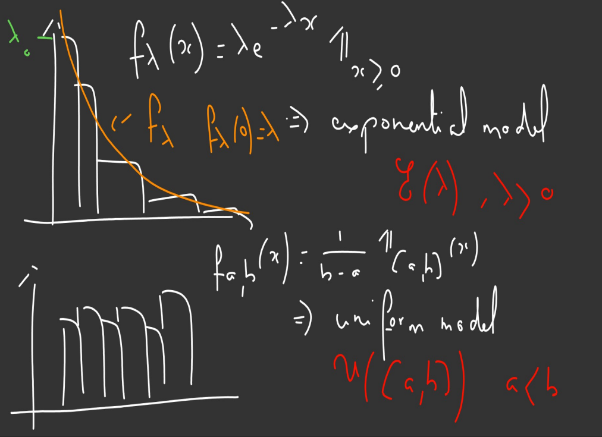
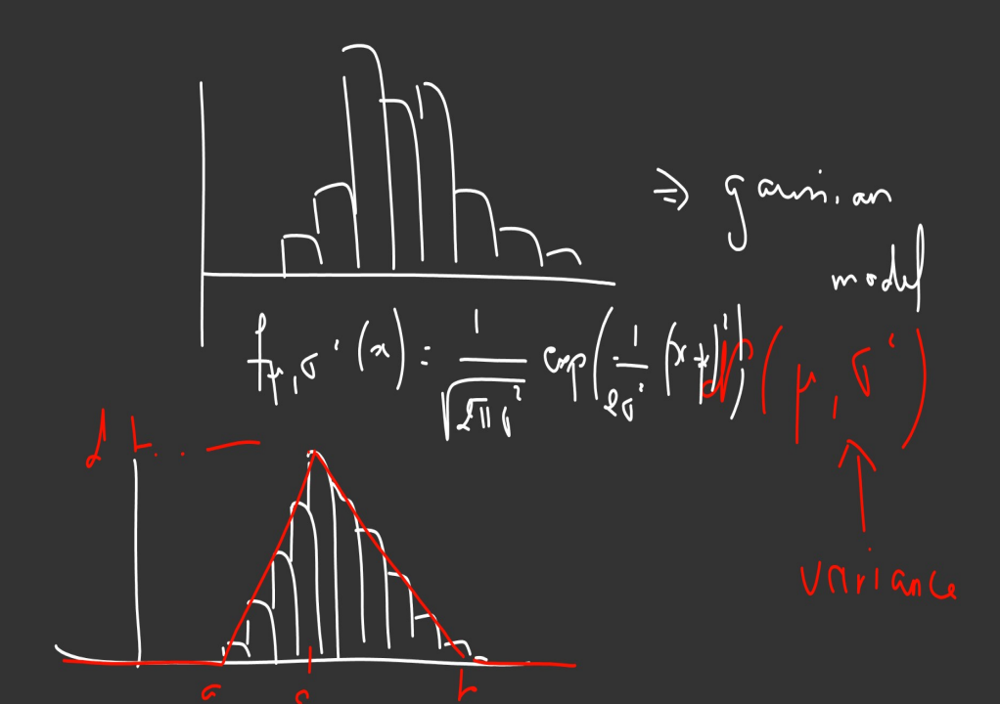

```{r setup, include=FALSE}
knitr::opts_chunk$set(echo = TRUE)
```


## Introduction

Statistics notation:

1. If $X_1, ..., X_n$ are random variables (r.v).
2. $x_1, ..., x_n$ are observations.
3. If we write *i.i.d* means that the r.v are independent and identically distributed.

**First aim:** To propose a model for a random variable.

Generalization to multi-dimensional case:

- Y: response variable.
- $X^{(1)}, ...,X^{(p)}$: explanatory variables.

**Aim**: To find a functional link between $Y$ and the explanatory variables.

To find this functional link , the method to apply depends on the nature of the r.v's.

| Y 	| Model 	|
|:---:	|:---:	|
| Numeric 	| Linear model 	|
| Qualitative (labels) 	| Classification 	|

**Linear model**

A linear model is given by:

$Y_i = \beta_0 + \beta_1X^{1}_i + ... + \beta_pX^{p}_i + \varepsilon_i$

where:

- $\beta_0, ..., \beta_p$ are unknown *fixed* parameters that can be estimated by two methods: 
- Point estimation
- Confidence interval
- $\varepsilon$ is the noise and also a random variable.


## Chapter 1: Estimation for **one parameter**

**Previous Knowledge**

- Random Variable: 
- The notion of distribution.
- The expectation and variance
- The distribution function
- The classical distributions (in particular the Gaussian)
- The Law of Large numbers and the Central Limit theorem

### Introduction

Given $x_1, ..., x_n$ numeric observations, to try to find a correct parametric model, we can use 2 [graphs](https://chartio.com/learn/charts/histogram-complete-guide/):

| Plot type 	| Variable type 	| Density 	|
|:---:	|:---:	|:---:	|
| Bar plot 	| Discrete 	| count/n 	|
| Histogram 	| Continuous 	| count for a bin/ n x (length of the bin) 	|


**Barplot for discrete variables**

```{r create_barplot}
max.temp <- c(22, 27, 26, 24, 23, 26, 28)

barplot(max.temp,
        main = "Maximum Temperatures in a Week",
        xlab = "Degree Celsius",
        ylab = "Day",
        names.arg = c("Sun", "Mon", "Tue", "Wed", "Thu", "Fri", "Sat"))
```


**Histogram for continuous variables** 


```{r create_histogram}

A <- rnorm(500, 0, 1)

## The default execution of this function doesn't generate a density:
hist(A)


## You need to set freq = FALSE:
hist(A, freq = FALSE)


## You can set the numbers of bins that you want to use:
hist(A, freq = FALSE, breaks = 100)

# But in order to create more breaks, you need to increase the
# numbers of observations:


A <- rnorm(50000, 0, 1)
hist(A, freq = FALSE, breaks = 100)

```


To propose a parametric model:

1. Make a graphical representation of the observations.
2. Guess a theoretical model by looking the previous graphic.

**Examples:** 

Pasarlos a R!!

Example 1: 

Example 2: 

**Question:** with a representation, we can guess a parametric family of models, denoted by 
$\{P_{\Theta}, \theta \in \Theta \}$.
How to guess a correct value for $\theta$ thanks to the observations?

**Answer:** *Estimation*.

### Point estimation

Let $x_i$ an observation of a r.v $X_i$
we assume that $X_1, ..., X_n$ are *i.i.d* with common distribution $P_{\theta}$.

##### Estimator 

**Definition:** An estimator of $\Theta$ is just a function of $X_1, ... X_n$ that **does not depend onto others unknown parameters.**

**Remark:** An estimator is a random variable! 

##### Estimation 
**Definition:** An estimation is the value of an estimator computed thanks to the observations.

**Example**

Consider $X_1, ..., X_n$ exponential distributed and *i.i.d*, an *estimator* of $\lambda$
is $\hat{\lambda}_n = \dfrac{n}{\sum X_i}$ an *estimation* is
$\hat{\lambda}_n = \dfrac{n}{\sum x_i}$.

| Distribution 	| Parameter 	| Estimator 	| Estimation 	|
|:---:|:---:|:---:|:---:|
|Exponential $\xi(\lambda)$ 	| $\lambda$ 	| $\dfrac{n}{\sum X_i}$|$\dfrac{n}{\sum x_i}$|


##### Bias (for univariate parameter)

**Definition:** Let consider $\hat{\theta}_n$ an estimator of $\theta$.

The bias of $\hat{\theta}_n$ is defined by:

$$b(\hat{\theta}_n) := \mathbb{E}(\hat{\theta}_n) - \theta$$ 

* We say that $\hat{\theta}_n$ is an unbiased estimator if

$$\forall n \in \mathbb{N}^{+} \quad b(\hat{\theta}_n) = 0$$

* We say that $\hat{\theta}_n$ is *asymptotic unbiased* estimator if:

$$b(\hat{\theta}_n) \rightarrow 0 \\ n \rightarrow +\infty$$


**How to construct  estimator?**

- Method of moments
- less computations
- based on the Law of large numbers

- Maximum likelihood

#### Method of moments

Let $\theta$ a parameter to estimated, parameter which is associate to  
$X_1, ..., X_n$ *i.i.d* r.v.

Let consider $k \in \mathbb{N}^*$:

- the moment of order $k$ : $\mathbb{E}[X^k]$
- the centered moment of order $k$: $\mathbb{E}[X - \mathbb{E}[X]]^k$

If there exist a value $k$ such that:

- (a) $\mathbb{E}[X^k] =  g(\theta)$

- (b) $\mathbb{E}[[X - \mathbb{E}[X]]^k] =  h(\theta)$

Then the estimator $\hat{\theta}_n$ of $\theta$ is solution of:

- (a) $g(\hat{\theta}_n) = \dfrac{1}{n}\sum X_i^k$

- (b) $h(\hat{\theta}_n) = \dfrac{1}{n}\sum (X_i - \overline{X}_n)^k$ 

where 

$$\overline{X}_n = \dfrac{1}{n}\sum X_i$$ 

is the **empirical mean**.


**Remark: Exponential Distribution**

If Let $X \sim \xi(\lambda)$, then:

- $f_\lambda(x) = \lambda\exp(-\lambda x) \mathbf{1}_{x \geq 0}$
- $\mathbb{E}[X] = \int_{\mathbb{R}} x\cdot f_\lambda(x) dx$
- $V[X] = \mathbb{E}[X^2] - (\mathbb{E}[X])^2$

**Transfer formula:**

$$\mathbb{E}[l(X)] =  \int_{\mathbb{R}} l(x)\cdot f_\lambda(x) dx$$

#### Applications

1. Let consider $X_1, ..., X_n$ exponential distributed and *i.i.d* compute an 
estimator of $\lambda$ using the methods of moments.

**Solution:**

Let $X \sim \xi(\lambda)$, so:

$$\mathbb{E}[X] = \dfrac{1}{\lambda}  \quad \text{and} \quad V[X] = \dfrac{1}{\lambda^2}$$
By applying the method of moments ($k=1$) we get:

$\dfrac{1}{\hat{\lambda}_{n,1}} = \dfrac{1}{n}\sum X_i$ 

Thus:

$$\hat{\lambda}_{n,1} = \dfrac{n}{\sum X_i}$$

in the same way but using the variance  ($k=2$), we get:

$\dfrac{1}{\hat{\lambda}_{n,2}^2} = \dfrac{1}{n}\sum (X_i - \overline{X}_n)^2$ 

Thus:

$$\hat{\lambda}_{n,2} = \dfrac{\sqrt{n}}{\sqrt{\sum (X_i - \overline{X}_n)^2}}$$

```{r method_moments}

A = rexp(500, 4)

1/mean(A)

m = c()

for (i in 1:50) {
  A = rexp(500, 4)
  m[i] <- 1/mean(A)
}


mean(m)

boxplot(m)


## With more observations we got less variation (500 -> 5000)

## Law of large numbers

m = c()

for (i in 1:50) {
  A = rexp(50000, 4)
  m[i] <- 1/mean(A)
}


mean(m)

boxplot(m)


```

2. Let consider $X_1, ..., X_n$  *i.i.d*  $\mathcal{U}([0, \sigma])$.

+ Determine an estimator of $\sigma$ using the methods of moments.
+ Let denote $\hat{\sigma}_n = 2\overline{X}_n$. 
Is $\hat{\sigma}_n$ an unbiased estimator?

**Solution:**

Let $X \sim \mathcal{U}([0, \sigma])$.


\begin{align*}
\mathbb{E}(X) = \int_{\mathbb{R}} x\cdot f_X dx = \int_{\mathbb{R}} x\cdot \dfrac{1}{\sigma}\cdot \mathbf{1}_{[0, \sigma]} dx = \dfrac{1}{\sigma}\int_{0}^{\sigma} x dx = \dfrac{1}{\sigma} \dfrac{x^2}{2} \Big|_0^\sigma = \dfrac{\sigma}{2} 
\end{align*}

By the method of moments, we get that an estimator $\hat{\sigma}_n$ is solution of:

$\dfrac{\hat{\sigma}_n}{2} = \dfrac{1}{n}\sum X_i = \overline{X}_n$

Thus:

$$\hat{\sigma}_n = 2\overline{X}_n$$
since $\hat{\sigma}_n$ it is a function of $X_1, ..., X_n$ it's an estimator.

Let's compute the bias for this estimator, let $n \in \mathbb{N}^*$.

$b(\hat{\sigma}_n ) = \mathbb{E}(\hat{\sigma}_n) - \sigma$

First, compute the expected value of $\hat{\sigma}_n$:


\begin{align*}
\mathbb{E}(\hat{\sigma}_n) &= \mathbb{E}(2\overline{X}_n)\\
&=    \mathbb{E}\bigg[\dfrac{2}{n}\sum X_i\bigg]\\
&=    \dfrac{2}{n}\sum\mathbb{E}[ X_i] \quad\text{(by linearity)}\\
&=    \dfrac{2}{n} \cdot n \cdot\mathbb{E}[X_1] \quad\text{(because are identically distributed)}\\
&=    \sigma
\end{align*}


Therefore $b(\hat{\sigma}_n ) = 0$ and then we conclude that $\hat{\sigma}_n = \overline{X}_n$ is an unbiased estimator for $\sigma$.

3. Let consider $X_1, ..., X_n$  *i.i.d*  $\mathcal{U}([-\sigma, \sigma])$.

Since $\mathbb{E}[X_1] = 0 \quad \text{(not a function of } \sigma)$

we can't use the first moment, then we use the second moment:

$V[X_1] = \dfrac{\sigma^2}{3}$

then we have:

$$\hat{\sigma}_n = \sqrt{\dfrac{3}{n}\sum(X_i - \overline{X}_n)^2}$$

#### The Maximum Likelihood


##### Likelihood

**Definition:** Let $X_1, ..., X_n$ independent random variables, whose distributions are all depending
on the same parameter $\theta$.

Let $x_1, ..., x_n$ observations of those r.v

$$
\mathcal{L}(x_1, ..., x_n, \theta) = \begin{cases} \displaystyle \prod_{i =1}^{n} P_{\theta}(X_i = x_i) \quad \text{(discrete framework)} \\ 
\displaystyle \prod_{i =1}^{n} f_{X_i, \theta}(X_i = x_i) \quad \text{(continuous framework)}
\end{cases}
$$

where $f_{X_i, \theta}$  are the density function of $X_i$.


##### Estimator thanks to the maximum likelihood

**Definition:** $\hat{\theta}_n$, an estimator for $\theta$, due to the maximum likelihood, is solution of:


$$
\mathcal{L}(x_1, ..., x_n, \theta) = \max_{\theta} \mathcal{L}(x_1, ..., x_n, \theta)
$$


#### Applications

1. Let consider $X_1, ..., X_n$ $\xi(\lambda)$ *i.i.d*. Compute the maximum likelihood estimator.

**Solution:**

Let $x_1, ..., x_n \in \mathbb{R}$.


\begin{align*}
\mathcal{L}(x_1, ..., x_n, \theta) &= \displaystyle \prod_{i =1}^{n} \lambda e^{-\lambda x_i}\cdot\mathbf{1}_{x_i \geq 0} \\
&=    \lambda^n e^{-\lambda \sum x_i}\cdot \mathbf{1}_{\min{(x_i) \geq 0}}  
\end{align*}


we need to maximize with respect to $\lambda$, since $\mathbf{1}_{\min(x_i)}$ does not depend on $\lambda$ we can forget it, and consider:

$$h(\lambda) = \lambda^n e^{-\lambda \sum x_i}$$

taking $\log$ in both sides, with get a better expression to deal with.


$$g(\lambda) = \log(h(\lambda)) = \log(\lambda^n e^{-\lambda \sum x_i}) = n\log(\lambda) - \lambda \sum x_i$$
Since

$g'(\lambda) = \dfrac{n}{\lambda} -  \sum x_i$ then $\lambda = \dfrac{n}{ \sum x_i} = \dfrac{1}{\overline{X}_n}$ is critical point.

and $g''(\lambda) = \dfrac{-n}{\lambda^2} <0$ then this critical point correspond to a maximum. 

So, $\lambda = \dfrac{1}{\overline{X}_n}$ is solution of the maximization problem and therefore the *Maximum likelihood estimator* is:

$$\hat{\lambda}_n = \dfrac{n}{ \sum X_i}$$


2. Let consider $X_1, ..., X_n$  *i.i.d* $\mathcal{U}([0, \theta])$
+ Compute the maximum likelihood estimator.
+ Compute the bias of this estimator and transform it into an unbiased one.


**Solution:**

Compute the maximum likelihood estimator:

\begin{align*}
\mathcal{L}(x_1, ..., x_n, \theta) &= \displaystyle \prod_{i =1}^{n} f_{\theta}(x_i) \\
&=    \prod_{i =1}^{n} \dfrac{1}{\theta}\cdot \mathbf{1}_{[0, \theta]}(x_i)  \\
&= \dfrac{1}{\theta^n} \cdot \mathbf{1}_{\min (x_i) \geq 0} \cdot \mathbf{1}_{\max(x_i) \leq \theta}
\end{align*}

Since $\mathbf{1}_{\min (x_i) \geq 0}$ does not depend on $\lambda$ we can forget it, and consider:

$$g(\lambda) = \dfrac{1}{\theta^n} \cdot \mathbf{1}_{\max(x_i) \leq \theta} = \dfrac{1}{\theta^n} \cdot \mathbf{1}_{[\max(x_i), +\infty[} (\theta)$$

we can't compute $g'$ since this function it's not derivable in all points.

But since the function $\dfrac{1}{t^n}$ it's decreasing we can conclude that the maximum estimator likelihood is given by:

$$
\hat{\theta}_n = \max(X_i)
$$

Compute the bias of this estimator and transform it into an unbiased one.

In order to compute the bias of this estimator, we have to compute: $\mathbb{E}(\hat{\theta}_n) = \mathbb{E}(\max(X_i))$.

To do this we need to determine the density function of this new random variable $\max(X_i)$.

**How to compute a density?**

1. First step: Computation of the distribution function.

Let $t \in \mathbb{R}$.


\begin{align*}
F_{\hat{\theta}_n}(t) &= P(\hat{\theta}_n \leq t) \\
&=    P(\max(X_i) \leq t)  \\
\iff \\
&    P(X_1 \leq t, ..., X_n \leq t) \\
&=    \displaystyle \prod_{i =1}^{n} P(X_i \leq t) \quad \text{(by independency of the r.v)} \\
&=    (P(X_1 \leq t))^n \quad \text{(because they are identically distributed.)}
\end{align*}


Since

$$
P(X_1 \leq t) = \int_{-\infty}^{t} \dfrac{1}{\theta} \mathbb{1}_{[0, \theta]}(x)dx = 
\begin{cases}
0  &  t < 0 \\ \\
\dfrac{t}{\theta} & t \in [0,\theta] \\\\
1 & t >1
\end{cases}
$$

We conclude:

$$
F_{\hat{\theta}_n}(t) =
\begin{cases}
0  &  t < 0 \\\\
\dfrac{t^n}{\theta^n} & t \in [0,\theta] \\\\
1 & t >1
\end{cases}
$$

2. Second step: Computation of the density function.

Using the relation between the distribution and density function we have:

$$
f_{\hat{\theta}_n}(t) = F'_{\hat{\theta}_n}(t) = n\cdot\dfrac{t^{n-1}}{\theta^n}\cdot\mathbf{1}_{[0, \theta]}(t)
$$

3. Third step: Computation of $\mathbb{E}(\hat{\theta}_n)$

$$ \mathbb{E}[\hat{\theta}_n] = \int_{\mathbb{R}} x \cdot f_{\hat{\theta}_n}(x) dx = \dfrac{n}{n+1} \theta$$

Now we have:

$$ b(\hat{\theta}_n) = \mathbb{E}[\hat{\theta}_n] - \theta = -\dfrac{\theta}{n+1} \neq 0$$

Therefore $\hat{\theta}_n$ is not an unbiased estimator for $\theta$. But since $\displaystyle \lim_{n\to\infty} b(\hat{\theta}_n) = 0$ it is an asymptotically unbiased estimator for $\theta$.


**How to obtain an unbiased estimator?**

- First attempt: 

We have $\mathbb{E}[\hat{\theta}_n] - \theta = -\dfrac{\theta}{n+1}$, then:

\begin{align*}
\mathbb{E}[\hat{\theta}_n] - \theta + \dfrac{\theta}{n+1} &= 0 \\
\iff & \\
\mathbb{E}\bigg[\hat{\theta}_n + \dfrac{\theta}{n+1}\bigg] - \theta  &= 0 \\
\end{align*}

It is ok to consider $\tilde{\theta}_n = \hat{\theta}_n + \dfrac{\theta}{n+1}$ as unbiased estimator of $\theta$?

The answer is **no**, $\tilde{\theta}_n$ depends on an unkonown parameter ($\theta$ in this case), so by definition it is not an estimator!


- Second attempt: 

We have:


\begin{align*}
\mathbb{E}[\hat{\theta}_n] - \theta =- \dfrac{\theta}{n+1} &= 0 \\
\iff & \\
\mathbb{E}[\hat{\theta}_n] = \theta - \dfrac{\theta}{n+1}  \\
\iff & \\
\mathbb{E}[\hat{\theta}_n] = \dfrac{n}{n+1}\theta \\
\iff & \\
\mathbb{E}\bigg[\dfrac{n+1}{n}\hat{\theta}_n\bigg] = \theta \\
\iff & \\
\mathbb{E}\bigg[\dfrac{n+1}{n}\hat{\theta}_n\bigg] - \theta = 0\\
\end{align*}

Thus, $\dfrac{n+1}{n}\hat{\theta}_n$ is an unbiased estimator for $\theta$.

```{r estimator_unif}

## Comparing the estimators for the uniform distribution.

n= 100

U = runif(n, 0, 4)

theta = max(U)


for (i in 1:50) {
  U = runif(n, 0, 4)
  theta = c(theta, max(U))
}


mean(theta)

boxplot(theta)


## Adjust to make the estimator unbiased

thetab = (n+1)/n*theta

mean(thetab)

boxplot(thetab)


## With more observations

n= 100

U = runif(n, 0, 4)

theta = max(U)


for (i in 1:5000) {
  U = runif(n, 0, 4)
  theta = c(theta, max(U))
}


mean(theta)

boxplot(theta)

```

#### Property

Let $X_1, ..., X_n$ *i.i.d* random variables.

- Let $\mu = \mathbb{E}[X_1]$ (unknown)
- Let $\sigma^2 = V[X_1]$ (unknown)

A classical estimator for:

- $\mu$ is 
$$\hat{\mu}_n = \overline{X}_n$$

- $\sigma^2$ is 

$$\hat{\sigma}_n^2 = \dfrac{1}{n} \sum(X_i - \overline{X}_n)^2$$


**Exercise**

Show that:

1. $\hat{\mu}$ is unbiased.
2. $\hat{\sigma}^2_n$ is biased and that $\dfrac{n}{n-1}\hat{\sigma}^2_n$ is unbiased.


**Solution:**

1. 

\begin{align*}
\mathbb{E}[\hat{\mu}_n] &= \mathbb{E}\bigg[\dfrac{1}{n} \sum X_i\bigg] \\
&=    \dfrac{1}{n}\sum \mathbb{E}[X_i] \quad \text{(by linearity)} \\
&=    \dfrac{1}{n}n\cdot  \mathbb{E}[X_1] \quad \text{(as they are indentically distributed)} \\
&= \mathbb{E}[X_1]  
\end{align*}


Therefore: $\hat{\mu}_n = \overline{X}_n$ is an unbiased estimator for $\mu$.

2.

First note that we can rewrite $\hat{\sigma}_n^2$ as follows:


\begin{align*}
\hat{\sigma}_n^2 &= \dfrac{1}{n} \sum_{i =1}^n(X_i - \overline{X}_n)^2 \\
&=    \dfrac{1}{n} \sum_{i =1}^n \big(X_i^2 - 2X_i\overline{X}_n + \overline{X}_n^2\big) \\
&=    \dfrac{1}{n} \sum_{i =1}^n X_i^2 - 2\overline{X}_n \bigg(\dfrac{1}{n} \sum_{i =1}^n X_i\bigg)+ \overline{X}_n^2 
\quad \text{(check that factors that depends on i)} \\
&=    \dfrac{1}{n} \sum_{i =1}^n X_i^2 - 2\overline{X}_n^2 + \overline{X}_n^2 \\ 
&=    \dfrac{1}{n} \sum_{i =1}^n X_i^2 - \overline{X}_n^2 \\ 
\end{align*}


Now use this expression to compute the expectation:

\begin{align*}
\mathbb{E}[\hat{\sigma}_n^2] &= \mathbb{E}\bigg[\dfrac{1}{n} \sum_{i =1}^n X_i^2 - \overline{X}_n^2\bigg] \\
&=    \dfrac{1}{n}\sum_{i =1}^n\mathbb{E}[X_i^2] - \mathbb{E}\bigg[\overline{X}_n^2\bigg] \quad \text{(by linearity)} \\
&=    \dfrac{1}{n}\sum_{i =1}^n (V[X_i] +\mathbb{E}[X_i]^2) - ( V[\overline{X}_n] +\mathbb{E}[\overline{X}_n]^2) \quad \text{(by using the variance formula)} \\
&=    \sigma^2 + \mu^2 -  V[\overline{X}_n] - \mu^2 \quad \text{(by substituting the expressions of the variance and expectation)} \\
&=    \sigma^2 -  V[\overline{X}_n]
\end{align*}

Now lets compute $V[\overline{X}_n]$:

\begin{align*}
V[\overline{X}_n] &= V\bigg[\dfrac{1}{n} \sum_{i =1}^n X_i \bigg] \\
&=    \dfrac{1}{n^2} V\bigg[\sum_{i =1}^n X_i \bigg] \quad \text{(by linearity)} \\
&=    \dfrac{1}{n^2} \sum_{i =1}^n  V[X_i] \quad \text{(because they are indepent)}  \\
&=    \dfrac{\sigma^2}{n}
\end{align*}


Putting all together we get:

$$
b(\hat{\sigma}_n^2) = \mathbb{E}[\hat{\sigma}_n^2] - \sigma^2 =  -  V[\overline{X}_n] =  -  \dfrac{\sigma^2}{n} 
$$

so $\hat{\sigma}_n^2$ is an biased estimator.

But we can modify it to obtain an unbiased version by noticed that:

$$ \mathbb{E}\bigg[\dfrac{n}{n-1}\hat{\sigma}_n^2\bigg]=\sigma^2$$
Therefore:

$$\hat{\sigma}_{n-1}^2 = \dfrac{n}{n-1}\hat{\sigma}_n^2 = \dfrac{1}{n-1} \sum_{i=1}^n(X_i - \overline{X}_n)^2$$

is an unbiased estimator for $\sigma^2$.

#### Theorem

Let $X_1, ..., X_n$ *i.i.d* with $\mu = \mathbb{E}[X_1]$ and $\sigma^2 = V[X_1]$.

- An unbiased estimator for $\mu$ is:
 
 $$
 \hat{\mu}_n = \overline{X}_n \quad \text{and it's variance is} \quad \dfrac{\sigma^2}{n}
 $$
 
- An unbiased estimator for $\sigma^2$ is:
 
 $$
 \hat{\sigma}_{n-1}^2 = \dfrac{1}{n-1} \sum_{i=1}^n(X_i - \overline{X}_n)^2
 $$
 
#### Quality of an estimator

##### Mean Quadratic Error

**Definition:** Let $\theta$ an unknown parameter, let $\hat{\theta}_n$ an estimator of $\theta$, the
mean quadratic error (MQE) is given by:

$$
MQE(\hat{\sigma}_n) = \mathbb{E}[(\hat{\sigma}_n - \sigma)^2]
$$

**Property:** 

$$MQE = V[\hat{\theta}_n] + ((b(\hat{\theta}_n)))^2$$

**Proof:**

Lets rewrite the $MQE$ definition.


\begin{align*}
MQE(\hat{\theta}_n) &= \mathbb{E}[(\hat{\sigma}_n - \sigma)^2] \\
&=    \mathbb{E}[(\hat{\sigma}_n - \mathbb{E}[\hat{\sigma}_n] + \mathbb{E}[\hat{\sigma}_n] - \sigma)^2] \quad \text{(by adding and substracting yhe same thing)}\\
&=    \underbrace{\mathbb{E}[(\hat{\sigma}_n - \mathbb{E}[\hat{\sigma}_n])^2]}_{V[\hat{\sigma}_n]} 
  + \underbrace{\mathbb{E}[(\mathbb{E}[\hat{\sigma}_n] - \sigma)^2]}_{\mathbb{E}[b(\hat{\sigma}_n)]^2}
  +2\underbrace{\mathbb{E}[(\hat{\sigma}_n - \mathbb{E}[\hat{\sigma}_n])(\mathbb{E}[\hat{\sigma}_n] - \sigma)]}_{A_n} 
\end{align*}

So to proof our result we just need to proof that $A_n = 0$.

\begin{align*}
A_n &= \mathbb{E}[\underbrace{(\mathbb{E}[\hat{\sigma}_n] - \sigma)}_{b(\hat{\sigma}_n)} \cdot(\hat{\sigma}_n - \mathbb{E}[\hat{\sigma}_n])] \\
&= \underbrace{b(\hat{\sigma}_n)}_{\text{deterministic term}} \cdot \mathbb{E}[\underbrace{(\hat{\sigma}_n - \mathbb{E}[\hat{\sigma}_n])}_{\text{this is a centeret r.v.}}] \quad{\text{(the expectation of a centered r.v is zero.)}} \\
&= 0 
\end{align*}


##### Comparison of estimators

**Definition:** Let $\theta$ an unknown parameter, $\hat{\theta}_{n, 1}$ and $\hat{\theta}_{n, 2}$ for $\theta$.

$\hat{\theta}_{n, 1}$ is better than  $\hat{\theta}_{n, 2}$  if

$$
\forall n \geq 1, \quad MQE(\hat{\theta}_{n, 1}) \leq MQE(\hat{\theta}_{n, 2}) 
$$


#### Application

Let $X_1, ..., X_n$ *i.i.d* $\mathcal{U}([0, \theta])$, compare the following estimators to see if one is better than the others.

- $\hat{\theta}_{n, 1} = 2\overline{X}_n$ 
- $\hat{\theta}_{n, 2} = \max({X}_n)$ 
- $\hat{\theta}_{n, 3} = \frac{n+1}{n}\overline{X}_n$ 

*Remember:*

$f_{\hat{\theta}_{n, 2}}(t) = n\dfrac{t^{n-1}}{\theta^n} \mathbf{1}_{[0, \theta]}(t)$


**Solution:**

Lets compute the $MQE$ of each estimator.

1. Since $\hat{\theta}_{n, 1}$ is an unbiased estimator for $\theta$, we have:


\begin{align*}
MQE(\hat{\theta}_{n,1}) &= V[\hat{\theta}_{n, 1}]   \\ 
&=    V[2\overline{X}_n]    \\
&=    4V[\overline{X}_n]   \\
&=    4\sum_{n=1}^nV[X_1]   \quad \text{(by using i.i.d)}   \\
&=    4\dfrac{\sigma^2}{12n} \quad \text{(check the variance of an uniform distribution)}
\end{align*}


Thus:

$$MQE(\hat{\theta}_{n,1}) = \dfrac{\sigma^2}{3n}$$

2. We already know that: $b(\hat{\theta}_{n,2}) = -\dfrac{\theta}{n+1}$ and $\mathbb{E}[\hat{\theta}_{n,2}] = \dfrac{n}{n+1}\theta$.

We have to compute $V[\hat{\theta}_{n,2}]$, since

$$
V[\hat{\theta}_{n,2}] = \mathbb{E}[(\hat{\theta}_{n,2})^2] - \mathbb{E}[\hat{\theta}_{n,2}]^2
$$
and 

$$
\mathbb{E}[(\hat{\theta}_{n,2})^2] = \int_{\mathbb{R}}n\dfrac{t^{n-1}}{\theta^n} \mathbf{1}_{[0, \theta]}(t) dt = \dfrac{n}{n+2}\theta^2
$$

Therefore:


\begin{align*}
MQE(\hat{\theta}_{n,2}) &= V[\hat{\theta}_{n,2}] - b(\hat{\theta}_{n,2})^2    \\
&=    \dfrac{n}{n+2}\theta^2 - \dfrac{n^2}{(n+1)^2}\theta^2 +\dfrac{1}{(n+1)^2}\theta^2 \\
&=    \dfrac{2}{(n+1)(n+2)}\theta^2
\end{align*}


3. Since $\hat{\theta}_{n, 3}$ is an unbiased estimator for $\theta$, we have:


\begin{align*}
MQE(\hat{\theta}_{n,3}) &= V[\hat{\theta}_{n, 3}]  \\ 
&=    V\bigg[\dfrac{n+1}{n}\hat{\theta}_{n, 2}\bigg]    \\
&=    \dfrac{(n+1)^2}{n^2}V[\hat{\theta}_{n, 2}]   \\
&=    \dfrac{(n+1)^2}{n^2}\cdot \dfrac{n}{(n+1)^2(n+2)}\theta^2  \\
&=    \dfrac{1}{n(n+2)}\theta^2 
\end{align*}

It is easy to check that for $n\geq 1$:

$$
3n \leq \frac{(n+1)}{2}(n+2) \leq n(n+2)
$$

Thus

$$
MQE(\hat{\theta}_{n,3}) \leq MQE(\hat{\theta}_{n,2}) \leq MQE(\hat{\theta}_{n,1})
$$

and we conclude that $MQE(\hat{\theta}_{n,3})$ it's the best estimator for $\theta$.


#### Theorem

Let $\theta$ an unknown estimator and $\hat{\theta}_n$ an unbiased estimator of $\theta$.

Cramer-Rao bound:

$$
V[\hat{\theta}_n] \geq \dfrac{1}{I_{n}(\theta)}
$$

where 

$$
I_n(\theta) = - \mathbb{E}\bigg[\dfrac{\partial^2 \log(\mathcal{L(x_1, ..., x_n; \theta)})}{\partial \theta^2}\bigg]
$$

is the *Fisher Information*.

This is valid under certain conditions:

- $I_n(\theta)$ should exist.
- The possible values of $X_i$ should not depend on $\theta$. ($\mathcal{U}([0, \theta])$ not works.)

#### Improve estimators.

1. If you just have one estimator $\hat{\theta}_n$, you consider:

$$
\lambda\cdot\hat{\theta}_n
$$

with $\lambda \in \mathbb{R}^*$ and find $\lambda$ that minimize: 

$$MQE(\lambda \hat{\theta}_n)$$

2. If you have two estimators $\hat{\theta}_{n, 1}, \hat{\theta}_{n, 2}$.

  + Construct:

$$
\hat{\theta}_{n, a, b} = a\hat{\theta}_{n, 1} + b\hat{\theta}_{n, 2}
$$

  + Compute:
  
$$
M_{ab} := MQE(\hat{\theta}_{n, a, b})  
$$

  + Minimize $M_{ab}$ in $(a, b)$.
  
If $\hat{\theta}_{n, 1}$ and $\hat{\theta}_{n, 2}$ are **unbiased** estimators and you want to keep $\hat{\theta}_{n, a, b}$ unbiased, take $b = 1-a$.


#### Exercise

Let $X_1, ..., X_n$ **i.i.d** $\mathcal{P}(\lambda)$.

Compute an estimator for $\lambda$ by:

1. Method of moments.
2. Maximum likelihood.

**Solution**

1. Since $X \sim \mathcal{P}(\lambda) \Rightarrow \begin{cases} \mathbb{E}[X] = \lambda \\ V[X] = \lambda\end{cases}$

One estimator is:

$$
\hat{\lambda}_{n, 1} = \mathbb{E}[X] = \dfrac{1}{n}\sum_{i=1}^n X_i 
$$

another estimator for $\lambda$ is given by:

$$
\hat{\lambda}_{n, 2} = \mathbb{E}[X] = \dfrac{1}{n}\sum_{i=1}^n (X_i - \hat{X}_n)^2 
$$

2. Let $x_1, ..., x_n$ positive integers.


\begin{align*}
\mathcal{L}(x_1, ..., x_n; \lambda) &= \prod_{i=1}^n P(X_1 =x_i) \quad (\text{identically distributed}) \\
&=    \prod_{i=1}^n \bigg( \dfrac{\lambda^{x_i}e^{-\lambda}}{x_i!}\bigg) \\
&=   \lambda^{\sum x_i}e^{-n\lambda} \underbrace{\dfrac{1}{\prod_{i=1}^nx_i!}}_{\text{Not depends on }\lambda} \\
\end{align*}

since we need to minimize over $\lambda$ and $\log$ is an increasing function, we consider:

$$
g(\lambda) = \sum{x_i}\cdot\log(\lambda) - n\lambda
$$

now, find the critical to find the critical points, we solve

$$
g'(\lambda) = 0 \iff \lambda = \dfrac{1}{n}\sum x_i
$$

by analysing the sign of $g'$ we can conclude that this point is a maximum and therefore:

$$
\hat{\lambda}_{n, 3} = \dfrac{1}{n}\sum_{i=1}^n X_i 
$$

is an estimator for $lambda$ (the same obtained by the Methods of Moments).


#### Practical Work

1. Load the data in R software.
2. Propose a model for the variables associated to this file.
+ Make a visualization of this.


##### Data 1

Load the data.

```{r load_data1}

data1 <- as.matrix(read.table("data/data1.txt"))

## Some comments about the data and data types.

```


In this two graph we see that we can't determine just by looking at the graph a precise value for the parameters.

```{r graphic_data1}

## Set freq = FALSE in order to obtain a correct graph.

## Be careful about getting conclusions, since the function make the
## bins automatically.

hist(data1, freq = FALSE)

## Create a personalize breaks

data1_min = min(data1)
data1_max = max(data1)
l = seq(data1_min, data1_max, length = 10)

hist(data1, freq = FALSE, breaks = l)
```

We guess a Gaussian distribution.

How to estimate the parameters of the distribution?

1. Compute the empirical mean and statistical variance.
2. Plot the theoretical density that we guess.
3. Test the goodness of fitness.


Compute the empirical mean and statistical variance.

```{r compute_parameters_data1}

mhu <- mean(data1)

# When you compute the variance be careful and read the documentation
# in this case we have:
# "The denominator n - 1 is used which gives an unbiased estimator of the (co)variance 
# for i.i.d. observations"

sigma2 <- var(data1)

## You also can do it manually:

sigma2 <- 1/(nrow(data1)-1)*sum((data1 - mean(data1))^2)

```

Plot the theoretical density that we guess.


To this graph we use the information of the histogram associated to the data.

```{r get_hit_info, warning=FALSE}

## This generates a list, with all the hist information.

H <- hist(data1, freq = FALSE, plot = FALSE) ## ignore warning message
H

```

Comparison graph

```{r make_comparison_data1}

## Histogram info to use.
limits <- H$breaks
lmin <- limits[1]
lmax <- limits[length(limits)]

## Create our plot

## Create a vector that represents the [lmin, lmax] interval.
x <- seq(lmin, lmax, by = 0.01)

## Compute the density of the vector x associated to the parameters mhu y sigma2.
y <- dnorm(x, mhu, sqrt(sigma2))

## Set the y_max as the max in the empirical density and the 'artificial' density.
y_max = max(y, H$density)


## Make a plot for the comparison 

hist(data1, freq = FALSE, xlim = c(lmin, lmax), ylim = c(0, y_max*1.01))
par(new = TRUE)
plot(x, y, type = 'l', col = 'red'
     , xlim = c(lmin, lmax)
     , ylim = c(0, y_max*1.01)
     , xlab = ""
     , ylab = "")
```

Test the goodness of fitness.

```{r test_results_data1}

ks.test(x, 'pnorm', mhu, sqrt(sigma2))

## Outputs:

## The D: notion of distance between the data and the guess distribution. 
## The p-value: Used to reject or accept the propose model. 

```

Model values vs Real values

```{r model_values_vs_real_values_data1}
## Model values
#mhu
#sigma2

## Real values
real_mhu = 2.0
real_sigma = 0.1

cat('model_mhu:', mhu, 'vs', 'real_mhu:', real_mhu, '\n')
cat('model_sigma:', sqrt(sigma2), 'vs', 'real_sigma:', real_sigma)

```

##### Data 2


Load the data.

```{r load_data2}
## Loading the data
A <- as.matrix(read.table("data/data2.txt"))

A_max = max(A)
```

In this graph we can observe that there is potentially less observation in the last class, but if we look at the maximum of our dataset (`r A_max`), this last class exist because the maximum is slighter bigger than 7, so R automatically creates a new class just for this element. 

```{r graphic_data2}
## Make visualizations
hist(A, freq = FALSE)
```

To avoid this, we can use a strategy to creates better classes.

##### Create classes

If we have a dataset with $n$ observations.

The number classes classes is given by:

$$
K \approx 1 +3.22\times \log_{10}(n) \quad (\text{take the floor to get an integer value.})
$$
The limits of the classes are given by:

$$
a_0 = \min(x_i) - \varepsilon \\
a_K = \max(x_i) + \varepsilon
$$

the $\varepsilon$ correction is to ensure that all the observations are contained in our partition.

Also the $\varepsilon$ value depends on the order of magnitude of the data (numerator of the equation) and the precision of the software that we are using (denominator of the equation). 

$$
\varepsilon = \dfrac{\max(x_i) - \min(x_i)}{10^9}
$$
the other break points can be constructed as follow:

$$
a_i = a_0 + i\times amp \quad \text{for} \quad i\in \{1, ..., K \}
$$

where 

$$
amp = \dfrac{a_K -a_0}{K} \quad (\text{length of the classes})
$$
Lets use this in our dataset.

```{r graph_correct_classes}

## Compute correct classes parameters:
n = length(A)
K = floor(1 + 3.22*log(n, 10))
A_min = min(A)
A_max = max(A)

amp = (A_max - A_min)/K

epsilon = (A_max - A_min)/10^9

limits = seq(A_min, A_max, by = amp)


hist(A, freq = FALSE, breaks = limits)
```

We guess is an uniform distribution $\mathcal{U}[a, b]$.

In this cases we have two estimate 2 parameters, previously we had been working with the uniform distribution $\mathcal{U}[0, \theta]$ and prove that $2\overline{X}_n$ and $\dfrac{n+1}{n}\max(X_i)$ are unbiased and $\max(X_i)$ is a biased estimator for $\theta$.

In order to find unbiased estimators for the parameters $a, b$ of our distribution$\mathcal{U}[a, b]$ we should make all the computations again.

In practice we can consider the *naive* estimators:

$$
a = \min(X_i) \\
b = \max(X_i)
$$

or we can try to find unbiased estimators usign the Method of Moments:

Let $X \sim \mathcal{U}[a, b]$, so:

$$\mathbb{E}[X] = \dfrac{a+b}{2}  \quad \text{and} \quad V[X] = \dfrac{(b-a)^2}{12}$$
By applying the method of moments  we get:

$$\dfrac{\hat{a}_n + \hat{b}_n}{2}= \overline{X}_n  \quad \text{and} \quad  \dfrac{(\hat{b}_n - \hat{a}_n)^2}{12} = \hat{\sigma}_n^2$$
solving this system for $\hat{a}_n$ and $\hat{b}_n$ we obtain:

$$
\hat{a}_n = \dfrac{1}{2}\bigg(2\overline{X}_n - \sqrt{12\hat{\sigma}_n^2}\bigg) \\
\hat{b}_n = \dfrac{1}{2}\bigg(2\overline{X}_n + \sqrt{12\hat{\sigma}_n^2}\bigg)
$$

For this case we are going to use the Naive estimators, and compare again the 
Model values vs Real values.

```{r model_values_vs_real_values_data2}

## Model values
a = min(A)
b = max(A)

## Real values
real_a = 2.5
real_b = 7.1

cat('model_a:', a, 'vs', 'real_a:', real_a, '\n')
cat('model_b:', b, 'vs', 'real_b:', real_b)
```


##### Data 3

In progress

##### Data 4 

In progress

```{r}
## Loading the data
A <- as.matrix(read.table("data/data4.txt"))

barplot(table(A)/length(A))

## A binomial distribution can be approach by a Gaussian distribution.

## Methods of moments
## Don't forget to correct the estimation of np to be an integer.
## and then correct the ph value 


m = mean(A)
s2 = var(A)*(499/500)

ph = 1-s2/m
nh = m/ph

nh

nh = 10

ph = m/nh

ph

```

##### Data 5

In progress

```{r}
## Loading the data
A <- as.matrix(read.table("data/data5.txt"))

barplot(table(A)/length(A))

## A binomial distribution can be approach by a Gaussian distribution.

## Methods of moments
## Don't forget to correct the estimation of np to be an integer.
## and then correct the ph value 


m = mean(A)
s2 = var(A)*(499/500)

ph = 1-s2/m
nh = m/ph

nh

nh = 7

ph = m/nh

ph

## When p is small is very hard to get correct estimations of n when you 
## don't have enough number of observations
```


## Day 3 (In progress)


### Confidence interval

```{r}
m1 = c()

for (i in 1:50) {
  A = rnorm(500, 2, 1)
  
  m1 = c(m1, mean(A))
}

boxplot(A)

## Increase the number of observations

m2 = c()

for (i in 1:50) {
  B = rnorm(2000, 2, 1)
  
  m2 = c(m2, mean(B))
}

boxplot(B)


## Change the variance

m3 = c()

for (i in 1:50) {
  C = rnorm(2000, 2, 10)
  
  m3 = c(m3, mean(C))
}

boxplot(C)

## Create a data frame with all the observations

a = c(m1, m2, m3)
r = rep(c("A", "B", "C"), each = 50)

S = data.frame(x = a, l = r)
```
In this plot we can see that the approximation depends on the number of observations and the variance of the sample.

```{r}
boxplot(S$x ~ S$l)
```


### Chi squared distribution

```{r}
x = seq(0.1, 10, by =0.01)

y1 = dchisq(x, 1)
y2 = dchisq(x, 2)
y3 = dchisq(x, 3)
y4 = dchisq(x, 4)
y6 = dchisq(x, 6)
y9 = dchisq(x, 9)

y_max = max(y1, y2, y3, y4, y6, y9)

plot(x, y1, type = 'l', col = 'yellow', xlim = c(0, 10), ylim = c(0, 0.5))
par(new = TRUE)
plot(x, y2, type = 'l', col = 'green', xlim = c(0, 10), ylim = c(0, 0.5))
par(new = TRUE)
plot(x, y3, type = 'l', col = 'black', xlim = c(0, 10), ylim = c(0, 0.5))
par(new = TRUE)
plot(x, y4, type = 'l', col = 'blue', xlim = c(0, 10), ylim = c(0, 0.5))
par(new = TRUE)
plot(x, y6, type = 'l', col = 'pink', xlim = c(0, 10), ylim = c(0, 0.5))
par(new = TRUE)
plot(x, y9, type = 'l', col = 'red', xlim = c(0, 10), ylim = c(0, 0.5))
```


### t-student distribution

```{r}
x = seq(-10, 10, by =0.01)

y1 = dt(x, 1)
y2 = dt(x, 2)
y3 = dt(x, 3)
y4 = dt(x, 4)
y6 = dt(x, 6)
y20 = dt(x, 20)

y_norm = dnorm(x)

y_max = max(y1, y2, y3, y4, y6, y9)

plot(x, y1, type = 'l', col = 'yellow', xlim = c(-10, 10), ylim = c(0, y_max))
par(new = TRUE)
plot(x, y2, type = 'l', col = 'green', xlim = c(-10, 10), ylim = c(0, y_max))
par(new = TRUE)
plot(x, y3, type = 'l', col = 'black', xlim = c(-10, 10), ylim = c(0, y_max))
par(new = TRUE)
plot(x, y4, type = 'l', col = 'blue', xlim = c(-10, 10), ylim = c(0, y_max))
par(new = TRUE)
plot(x, y6, type = 'l', col = 'pink', xlim = c(-10, 10), ylim = c(0, y_max))
par(new = TRUE)
plot(x, y20, type = 'l', col = 'red', xlim = c(-10, 10), ylim = c(0, y_max))
par(new = TRUE)
plot(x, y_norm, type = 'l', col = 'black', xlim = c(-10, 10), ylim = c(0, y_max))


## A t-student distribution with a big enough k approach a Gaussian distribution

```


## Day 4 (In progress)


### Use of t-student table


### Confidence interval


```{r central_limit_theorem}

## We compute N observations of \overline{X}_n.


## Number of r.v.
n <- 5

## Number of observations
N <- 50000 

## Parameter exp distribution.
lambda <- 0.7

## Create a matrix
A <- matrix(rexp(n*N, lambda), ncol = n)

## Compute the mean for each row
M <- apply(A, 1, mean)  

## Visualization for M

hist(M, freq = F, breaks = 20)

###

Mo <- sort(M)
y <- 1:N/N

max_Mo <- max(Mo)

x <- seq(0, max_Mo, by = 0.01)
mu <- 1/lambda
v <- 1/(lambda^2)/n

yt <- pnorm(x, mu, sqrt(v))


plot(Mo, y, type = 'l', xlim = c(0, max_Mo), ylim = c(0,1))
par(new = TRUE)
plot(x, yt, type = 'l', xlim = c(0, max_Mo), ylim = c(0,1), col = 'red')

```


## Appendix 

### Types of convergence

